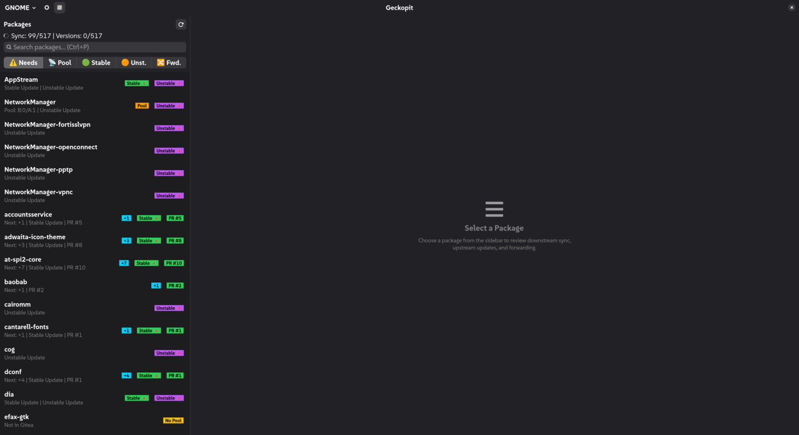
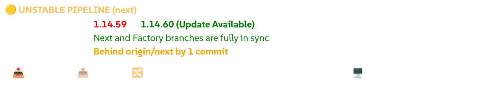
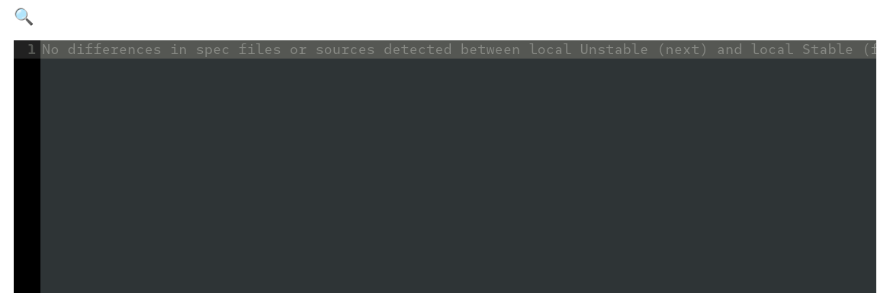
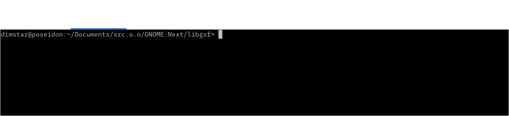
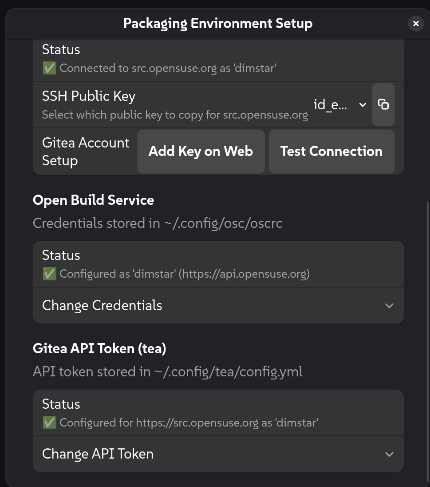

# 🦎 Geckopit User Guide: Packaging Workflow Cockpit

Welcome to the **Geckopit User Guide**. Geckopit is a graphical cockpit and command-line tool for openSUSE packagers maintaining multi-branch upstream repositories (such as `GNOME:Factory` and `GNOME:Next`).

This guide is organized by packaging tasks. Each section provides dedicated, step-by-step instructions for both the **Desktop Cockpit (GUI)** and the **Terminal Suite (CLI)**.

> 💡 **First time packaging on this machine?** See the [Appendix: Packaging Environment Setup & Onboarding](#appendix-packaging-environment-setup-onboarding) to verify or configure Git identity, SSH keys, OBS, and Gitea in under a minute.

---

## 📑 Table of Contents

1. [🚀 Overview & Cockpit Layout](#1-overview-cockpit-layout)
2. [🎯 Finding What Needs Attention & Browsing](#2-finding-what-needs-attention-browsing)
3. [⚙️ Upgrading a Package to a New Upstream Release](#3-upgrading-a-package-to-a-new-upstream-release)
4. [🔧 Auditing & Fixing Build Dependency Drift (Meson, CMake, Autotools, Python)](#4-auditing-fixing-build-dependency-drift-meson-cmake-autotools-python)
5. [🔀 Promoting Next Pre-Releases to Factory (Gitea PRs)](#5-promoting-next-pre-releases-to-factory-gitea-prs)
6. [🔄 Synchronizing Multi-Branch Workspaces](#6-synchronizing-multi-branch-workspaces)
7. [💾 Committing Packaging Changes & Whitespace Sanitization](#7-committing-packaging-changes-whitespace-sanitization)
8. [⌨️ Hands-Off-The-Mouse Keyboard Navigation](#8-hands-off-the-mouse-keyboard-navigation)
9. [🛠️ Appendix: Packaging Environment Setup & Onboarding](#appendix-packaging-environment-setup-onboarding)

---

## 🚀 1. Overview & Cockpit Layout

Geckopit provides two complementary interfaces:
* **Cockpit GUI (`geckopit`)**: A responsive desktop application with real-time multi-branch tracking, embedded terminal tabs, 1-click update/merge/PR actions, and syntax-highlighted code diffing.
* **Terminal CLI (`geckopit-cli`)**: A fast command-line suite for single-package inspection, batch audits, headless upgrades, and whitespace-sanitized commits.

### Figure 1: Full Cockpit Layout Overview



The Cockpit is organized into four main functional regions:
1. **HeaderBar**: Switch workspace profiles, run background multi-workspace sync, and adjust preferences.
2. **Package Master Sidebar**: Search bar, linked filter toolbar, and real-time package list with status badges.
3. **Detail Workspace**: Dual pipeline cards (`Stable` and `Unstable`), inline Meson drift repair, and code-diff viewer.
4. **Embedded Console Drawer**: Multi-tab terminal drawer with draggable tabs, font zooming, and auto-scroll pause.

---

## 🎯 2. Finding What Needs Attention & Browsing

### Understanding Status Badges

| Badge | Meaning | Action Recommended |
| :--- | :--- | :--- |
| `Local -N` | Local checkout is behind `origin` by *N* commits. | Fast-forward pull from origin. |
| `Local +N` | Local checkout has unpushed commits on disk. | Push commits to origin. |
| `Update Av.` | Upstream has released a newer version on release-monitoring.org. | Run package upgrade. |
| `Fwd.` | Developmental commits on `next` ready to promote to `factory`. | Review diff and create PR. |
| `Pool Ahead` | Local Factory has commits waiting to be submitted to Gitea pool. | Run pool submission. |
| `Pool Behind` | Central Gitea pool has updates that need to be pulled down. | Pull down pool updates into Factory. |
| `No Pool` | Package is not hosted in central Gitea pool. | Informational (suppressed from default sync table). |
| `Conflict` | Automated sync encountered git merge conflicts. | Resolve in console drawer shell. |

---

### 🖥️ In the Cockpit (GUI)

The linked toolbar at the top of the sidebar lets you switch between focused work queues and full catalog browsing:

### Figure 2: Quick Filter Tracks & Action Queue


* **Action Queue Mode (`⚠️ Needs` ON — Default)**:
  * Only packages requiring maintainer attention are displayed.
  * Click one or more track buttons (**`📡 Pool`**, **`🟢 Stable`**, **`🟠 Unst.`**, **`🔀 Fwd.`**) to narrow your work queue down to that specific task set (or their combined union).
  * If no track buttons are active, all actionable packages across all tracks are shown.
* **Catalog Browse Mode (`⚠️ Needs` OFF)**:
  * Toggling `⚠️ Needs` off switches the sidebar to browse all packages across the checkout tree.
  * The four track filter buttons are automatically dimmed (`sensitive=False`), and track shortcuts (`Ctrl+2`..`Ctrl+5`) are ignored.
  * Your previous track selections are remembered and immediately restored when you toggle `⚠️ Needs` back on.
* **Ignoring Stagnant Versions**:
  * If an upstream project has an abandoned pre-release tag cluttering your queue, hold **`Ctrl` + `Alt`** and **right-click** directly on the version label in the Unstable Pipeline card.
  * Select **`🚫 Ignore Version {Version}`**. The package will slide out of your filtered sidebar list. (Repeat and click **`🔄 Unignore`** to restore).

---

### 💻 In the Terminal (CLI)

Run high-throughput parallel batch audits across all packages in your workspace:

```bash
# Default audit: Shows only packages requiring action (hides up-to-date and non-pool items)
geckopit-cli

# Upstream release monitor: Query release-monitoring.org for new stable and unstable versions
geckopit-cli -v

# Forwarding audit: List next branches with commits ready to merge to factory
geckopit-cli -f

# Gitea pool presence audit: List packages not registered in the central Gitea pool
geckopit-cli --not-in-pool

# Include packages not in central pool in the main downstream sync table
geckopit-cli --include-not-in-pool

# Comprehensive single-package dashboard (run inside package checkout or pass directory)
geckopit-cli zenity

# Verify maintainer environment readiness (Git identity, SSH keys, OBS, and Gitea)
geckopit-cli --check-setup

# Interactively configure missing developer credentials and keys
geckopit-cli --setup
```

---

## ⚙️ 3. Upgrading a Package to a New Upstream Release

When an upstream project releases a new version, Geckopit automates the entire upgrade:
fetching new sources ➔ bumping the version in `.spec` ➔ extracting upstream release notes ➔ wrapping changelog bullets at standard 67 columns ➔ dropping merged patches ➔ checking for Meson dependency bumps.

Geckopit automatically adapts to how the package is maintained:
* **Service-managed packages (`_service`)**: Fetches upstream Git commits, drops merged patches, and updates packaging metadata.
* **Direct tarball packages (`.spec`)**: Reads downloaded source archives, extracts changelogs, and updates spec files.

---

### 🖥️ In the Cockpit (GUI)

### Figure 3: Dual Pipeline Action Cards & Dynamic Upgrade Button



1. Select a package showing the orange **`Update Av.`** badge (e.g. `zenity` or `libgsf`).
2. In the Pipeline card, review the version comparison (e.g. `4.2.0 ➔ 4.2.2`).
3. Click the dynamic update button (e.g. **`Update Next to 4.2.2`** or **`Update Factory to 4.2.2`**).
4. An embedded terminal tab opens in the bottom drawer, executing the upgrade engine, bumping the spec version, wrapping the `.changes` entry at 67 columns, and dropping merged patches.
5. Upon completion, the update button transitions to **`Up-To-Date`** and illuminates the **`Push`** button.
6. Click **`Push`** to push your packaging commits to `origin`.

---

### 💻 In the Terminal (CLI)

Run `geckopit-cli --upgrade` directly inside the package directory:

```bash
# Upgrade package to target revision (default: @PARENT_TAG@)
geckopit-cli --upgrade 4.2.2

# Or simulate the entire upgrade without modifying any files (dry-run)
geckopit-cli --upgrade 4.2.2 --dry-run
```

---

## 🔧 4. Auditing & Fixing Build Dependency Drift (Meson, CMake, Autotools, Python)

Upstream projects often bump minimum dependency constraints in `meson.build`, `CMakeLists.txt`, `configure.ac`, or `pyproject.toml` without maintainers noticing. Geckopit inspects the `.spec` file to identify active build systems (supporting declarative `BuildSystem:` tags, build invocation macros, `%pyproject_wheel`, and BuildRequires), and audits upstream declarations against your `.spec` `BuildRequires:` (including `%{python_module ...}`).

---

### 🖥️ In the Cockpit (GUI)

1. When a package has dependency drift, a compact yellow warning banner appears on the detail card:
   ```text
   ⚠️ Meson Drift: 1 unversioned  [🔧 Fix in .spec]
   ```
2. Hover over the banner or right-click to view the exact requirements.
3. Click **`🔧 Fix in .spec`**.
4. Geckopit immediately updates the `BuildRequires:` declaration in the `.spec` file (or updates the corresponding `%define` macro if defined), appends the standard changelog entry (`- Update version dependencies according to meson.build.`), and refreshes the view.

---

### 💻 In the Terminal (CLI)

Audit and fix dependencies directly from your shell:

```bash
# Audit dependencies against .spec BuildRequires
geckopit-cli --audit-deps

# Automatically update .spec BuildRequires / %define macros and record changelog
geckopit-cli --fix-deps
```

**Sample Output (`--audit-deps`):**
```text
=> Auditing Meson dependencies for 'zenity'...

⚠️  Meson Dependency Drift Detected:
   • pkgconfig(libadwaita-1) >= 1.2 (spec currently has unversioned BuildRequires)

💡 Recommended Action: Update BuildRequires in zenity.spec to match upstream requirements.
```

---

## 🔀 5. Promoting Next Pre-Releases to Factory (Gitea PRs)

During development cycles, maintainers test pre-releases on `next` before promoting them to `factory`.

---

### 🖥️ In the Cockpit (GUI)

### Figure 4: Integrated Code-Diff Viewer & Patch Clipboard Export



1. In the sidebar, click the **`🔀 Fwd.`** track filter (or press `Ctrl+5`).
2. Select a package showing forwardable commits (e.g. `Ahead by 1 commits`).
3. The integrated syntax-highlighted code-diff viewer displays the exact Git diff between `next` and `factory`.
4. **Copying Patches**: Click the **`edit-copy-symbolic` (📋 Copy)** icon in the diff header to copy the raw Git patch directly to your clipboard, confirmed by a floating toast notification.
5. **Creating Pull Requests**: Click **`Create Pull Request`** on the Pipeline card:
   * **Smart Changelog PR Prefiller**: Geckopit automatically constructs the PR title (e.g. `Update to version 4.2.2`) and extracts the newly added `.changes` entries directly into the PR description body.
   * Click **`Submit Pull Request`** to publish the PR on Gitea.

---

### 💻 In the Terminal (CLI)

Audit forwardable branches and pull request states:

```bash
# List all checkouts with developmental commits on next ahead of factory
geckopit-cli --forward

# Include active Gitea pull request status
geckopit-cli --forward --pr

# Only display packages ready for forward that do NOT yet have an active PR
geckopit-cli --forward --no-pr
```

---

## 🔄 6. Synchronizing Multi-Branch Workspaces

Synchronize your local workspace trees with remote tracking branches across all profile checkouts.

---

### 🖥️ In the Cockpit (GUI)

### Figure 5: Embedded Multi-Tab Console Drawer



1. Click the **`🔄 Sync Workspace`** button in the HeaderBar.
2. Geckopit synchronizes all package checkouts in the background. A spinner animates on the button while working.
3. The console drawer remains hidden if the sync completes cleanly.
4. **Notifications**:
   * Clean sync: `✅ Synced 12 package(s): glib2, gtk4, gvfs, mutter...`
   * Up-to-date: `✅ Workspace is already up to date`
   * Merge conflicts: The console drawer automatically springs open focusing the shell tab, and the notification shows:
     `⚠️ Workspace sync encountered warnings or conflicts (glib2, gtk4)`

---

### 💻 In the Terminal (CLI)

Run workspace synchronization from the command line:

```bash
# Parallel fast-forward workspace synchronization
geckopit-cli --sync

# Fetch remote objects only without merging
geckopit-cli --fetch
```

---

## 💾 7. Committing Packaging Changes & Whitespace Sanitization

Geckopit includes a modernized packaging commit helper (replacing legacy `gc.sh`). It ensures clean Git history by sanitizing trailing whitespace and preventing review artifacts from being accidentally committed.

---

### 🖥️ In the Cockpit (GUI)

* Each pipeline card provides dedicated one-click terminal launchers:
  * **`🖥️ Terminal (factory)`**: Launches an embedded console drawer tab navigated to the package's local stable worktree.
  * **`🖥️ Terminal (next)`**: Launches an embedded console drawer tab navigated to the package's local unstable worktree.
* Review your working tree changes and run your packaging commit directly in the drawer.

---

### 💻 In the Terminal (CLI)

Run `geckopit-cli --commit` inside any package directory:

```bash
# Stages packaging files, strips trailing whitespace, and pre-fills $EDITOR with .changes diff
geckopit-cli --commit

# Commit without opening an interactive editor (uses .changes diff directly)
geckopit-cli --commit --no-edit
```

**Defensive Protections:**
* Automatically strips trailing whitespace from modified `.spec`, `.changes`, and packaging files before staging.
* Stages only packaging files and source services, ignoring untracked build artifacts, cloned upstream directories, and temporary review logs.
* Extracts newly added entries from `*.changes` and pre-populates your `$EDITOR` commit template.

---

## ⌨️ 8. Hands-Off-The-Mouse Keyboard Navigation

Power users never need to reach for the mouse. Geckopit provides full keyboard control with defensive input guards:

| Shortcut | Action | Scope / Context |
| :--- | :--- | :--- |
| **`/`** or **`Ctrl` + `P`** | Focus the package search entry | Anywhere in Cockpit |
| **`Enter`** or **`Down`** | Confirm search and select first matching package | Inside search entry |
| **`j`** or **`Down`** | Step to the next package in the list | Package list navigation |
| **`k`** or **`Up`** | Step to the previous package in the list | Package list navigation |
| **`Ctrl` + `1`** | Toggle **Action Queue** vs. **Catalog Browse** mode | Sidebar toolbar |
| **`Ctrl` + `2`** | Toggle **📡 Pool Sync** track filter | Action Queue mode |
| **`Ctrl` + `3`** | Toggle **🟢 Stable Updates** track filter | Action Queue mode |
| **`Ctrl` + `4`** | Toggle **🟠 Unstable Updates** track filter | Action Queue mode |
| **`Ctrl` + `5`** | Toggle **🔀 Forwarding** track filter | Action Queue mode |
| **`Ctrl` + `F`** | Activate inline search inside the diff viewer | When viewing diffs |
| **`Ctrl` + `+` / `-` / `0`** | Zoom console terminal font (with floating `%` badge) | In terminal drawer |
| **`F5`** or **`Ctrl` + `R`** | Refresh currently selected package (instant priority scan) | Active package |
| **`Ctrl` + `Shift` + `R`** | Rescan all packages in the workspace | Global |
| **`Ctrl` + `Shift` + `S`** | Fetch & Sync workspace (`git-project-sync`) | Global |
| **`F1`** | Open User Guide in browser | Anywhere in Cockpit |

*Note: Defensive input guards prevent shortcuts from intercepting keystrokes while you are actively typing inside an embedded terminal shell or text field.*

---

## 🛠️ Appendix: Packaging Environment Setup & Onboarding

When setting up Geckopit on a new machine, laptop, or Flatpak installation, four developer pillars must be configured to fetch sources, manage pull requests, and commit changes:
1. **Git Identity**: Your `user.name` and `user.email` used in commit headers.
2. **SSH Authentication**: An SSH keypair and authenticated connection to `gitea@src.opensuse.org`.
3. **Open Build Service (OBS)**: Your openSUSE credentials in `~/.config/osc/oscrc`.
4. **Gitea CLI (`tea`)**: An API token configured in `~/.config/tea/config.yml`.

---

### In the Cockpit (GUI)

Click the **Setup & Verification** button (`avatar-default-symbolic`) on the right side of the HeaderBar to open the interactive setup assistant:

### Figure 6: Packaging Environment Setup Dialog



* **Git Identity**: Fill in your Full Name and Packaging Email, then click **Save**.
* **SSH Authentication**:
  * If no SSH keys exist, click **Generate ed25519** to create a secure keypair automatically.
  * If keys already exist, select your preferred public key from the dropdown list and click the **📋 Copy** icon.
  * Click **Add Key on Web** to open `src.opensuse.org/user/settings/keys` in your browser and paste the key.
  * Click **Test Connection** to verify access against `gitea@src.opensuse.org` without freezing the interface.
* **Open Build Service (OBS)**:
  * Shows your existing configuration status at a glance.
  * Expand **Change Credentials** to enter an updated username and password/token, securely saving to `~/.config/osc/oscrc` with `0600` permissions.
* **Gitea API Token (`tea`)**:
  * Shows your existing configuration status.
  * Click **Generate Token on Web** to open `src.opensuse.org/user/settings/applications`.
  * Expand **Change API Token**, paste your token, and click **Save Token** to configure `~/.config/tea/config.yml`.

---

### In the Terminal (CLI)

Verify or configure your environment headlessly or step-by-step from your terminal:

```bash
# 1. Non-destructive readiness check across all 4 pillars
geckopit-cli --check-setup

# 2. Interactive step-by-step onboarding wizard
geckopit-cli --setup
```

The interactive wizard tests existing settings, offers to generate keys and configurations, displays clickable web links, and automatically validates connections before concluding.

---

*For technical architecture, command-line reference, and helper internals, see [MAINTAINERS_GUIDE.md](MAINTAINERS_GUIDE.md).*
